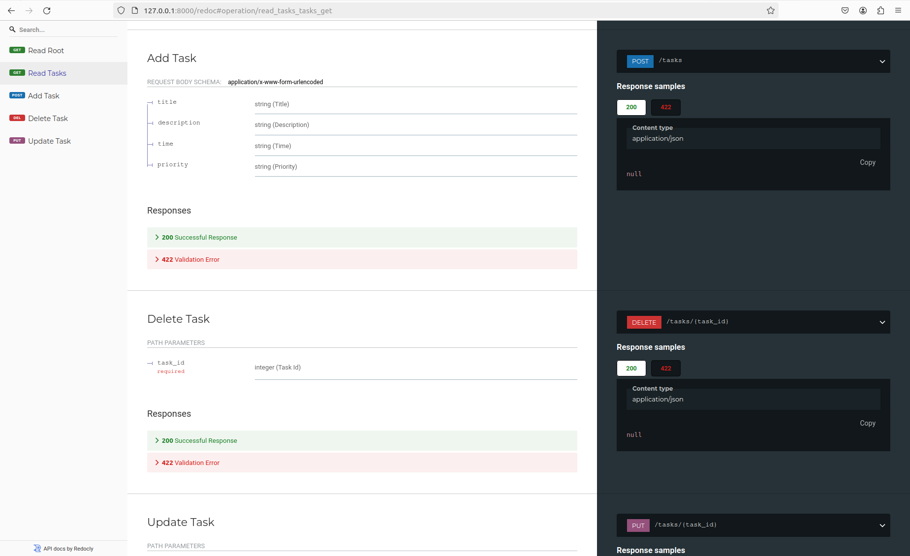
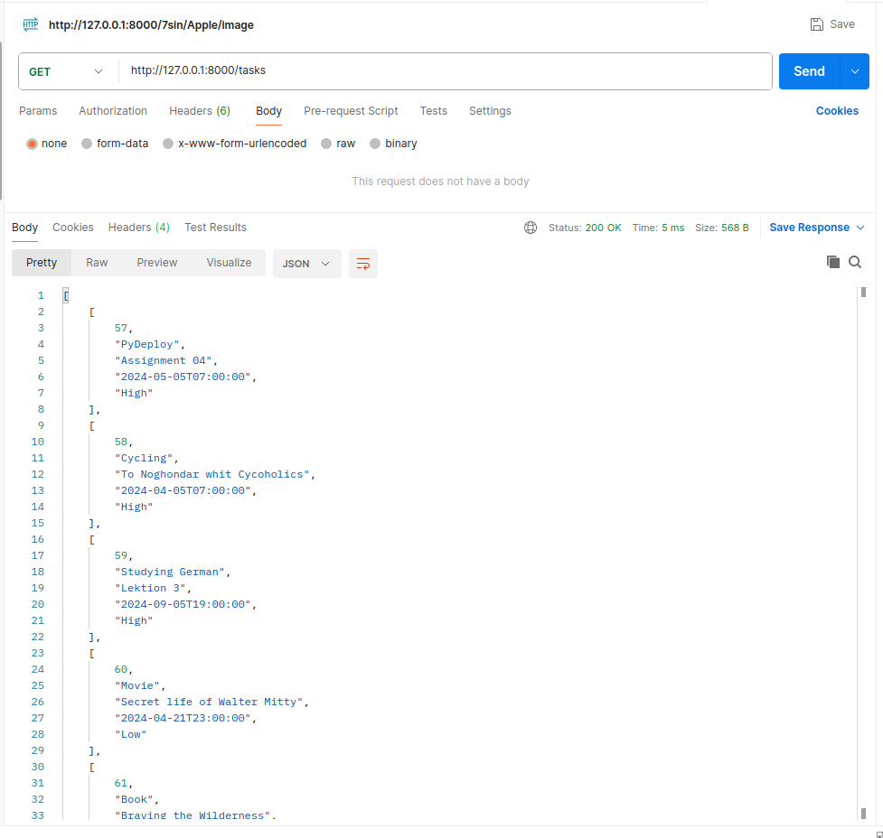
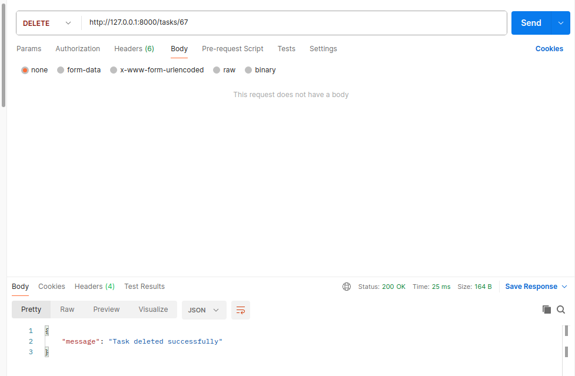

# To Do List API

#### get: /tasks
it will show you all tasks and details.

#### post: /tasks
by using post you can add a new task to database.

Be carefull to write the keys as you can see in the picture below.

#### delete: /tasks/id

To delete a task just enter a valid id and run the request.

#### put: /tasks/id

To update a task just use put and enter new values.

!Remember you have to add all of the values!

