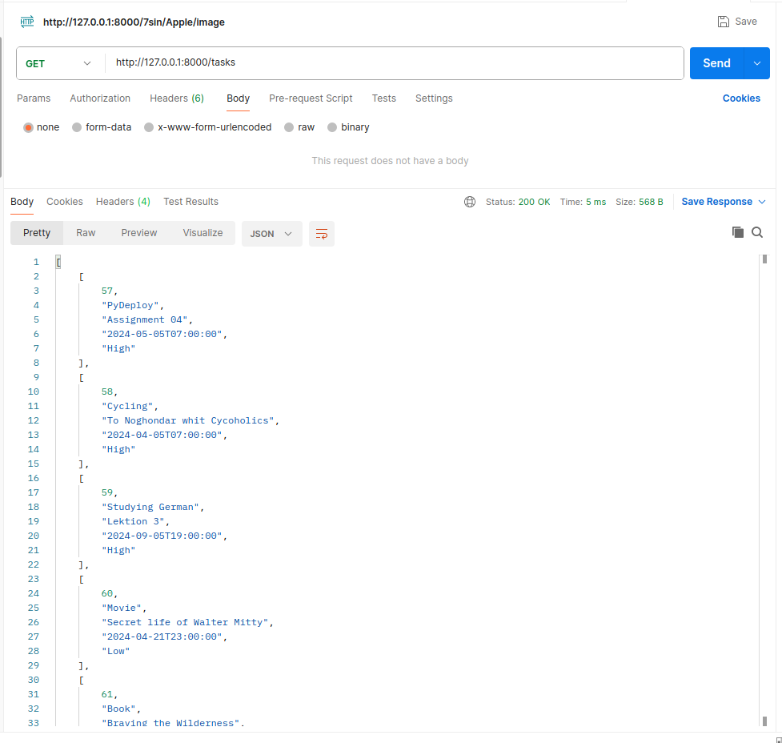

# To Do List 

## Overview
This is a Todo application built with FastAPI and SQLite. It provides a simple API for managing tasks.

## Features
- CRUD operations for tasks (Create, Read, Update, Delete)
- SQLite database backend
- Error handling for HTTP exceptions
- Dockerized!

## Usage
use this link:
```
https://fastapi-app.liara.run/docs
```

### Note:
Use the link above! What you see in the screenshots is for local usage.


## Using postman:

#### get: /tasks
it will show you all tasks and details.



#### post: /tasks
by using post you can add a new task to database.

Be carefull to write the keys as you can see in the picture below.


#### delete: /tasks/id

To delete a task just enter a valid id and run the request.


#### put: /tasks/id

To update a task just use put and enter new values.

!Remember you have to add all of the values!


