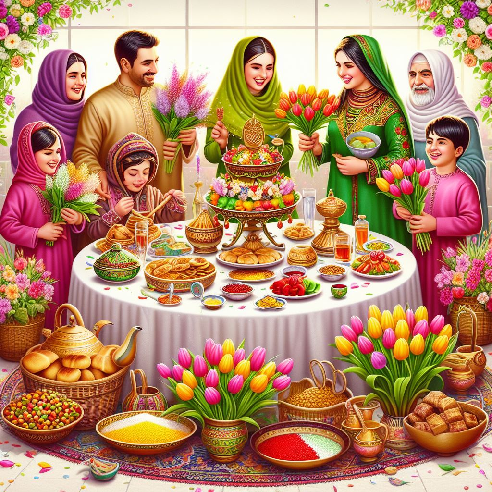

# 7sin

## Norooz is Iranians traditional fest and the most important part of it is 7sin:
A sacred arrangement of 7 symbolic items, each representing aspects of the natural world and spiritual values.

It will show you the details.

the link is: https://render-ag7y.onrender.com

## commands:
/, 

/7sin, 

/7sin/"item", note: you should choose between 7sin items.