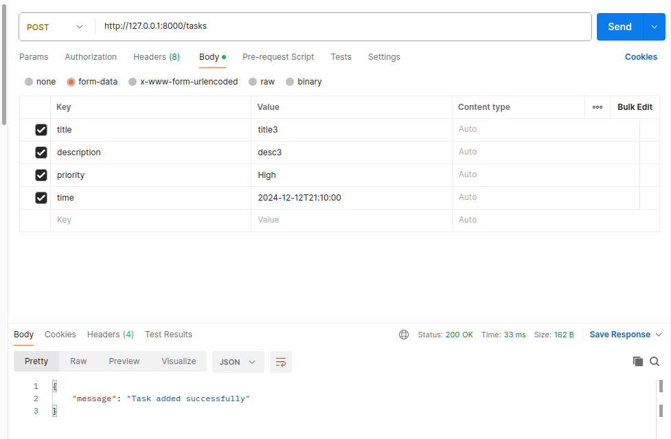
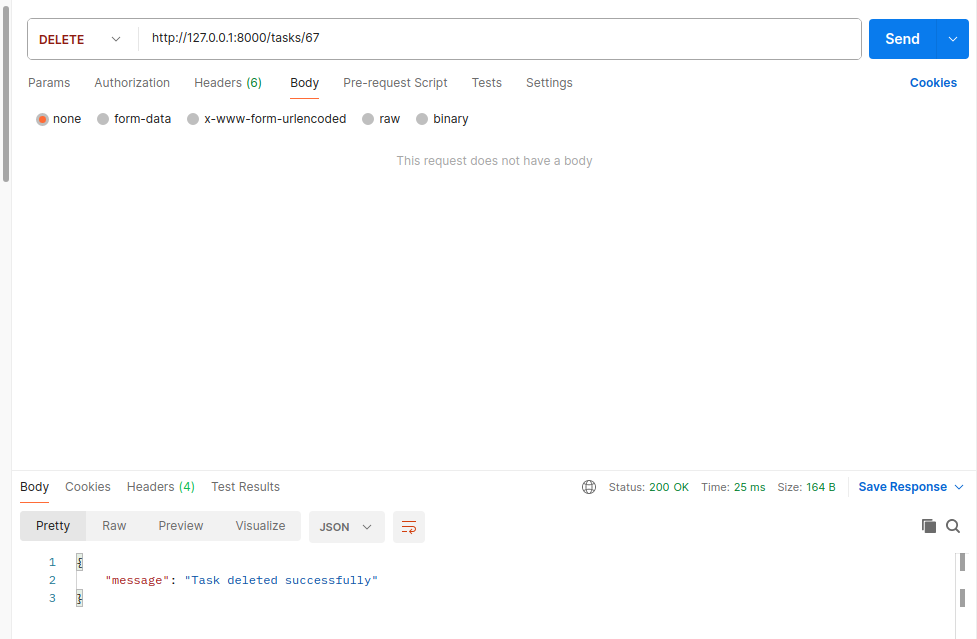

# To Do List API


## Overview
This is a Todo application built with FastAPI and SQLite. It provides a simple API for managing tasks.

## Features
- CRUD operations for tasks (Create, Read, Update, Delete)
- SQLite database backend
- Error handling for HTTP exceptions

## Requirements
- Python 3.x
- FastAPI
- SQLite3

## Installation
1. Clone the repository:
   ```bash
   git clone <repository_url>
   cd <repository_directory>

## Install Dependencies
```bash
pip install -r requirements.txt
```

## Usage
* Start the FastAPI server:
```
uvicorn main:app --reload
```

## Using postman:

#### get: /tasks
it will show you all tasks and details.


#### post: /tasks
by using post you can add a new task to database.

Be carefull to write the keys as you can see in the picture below.



#### delete: /tasks/id

To delete a task just enter a valid id and run the request.



#### put: /tasks/id

To update a task just use put and enter new values.

!Remember you have to add all of the values!


